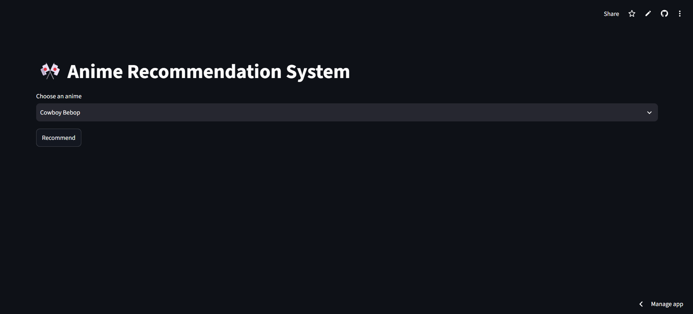
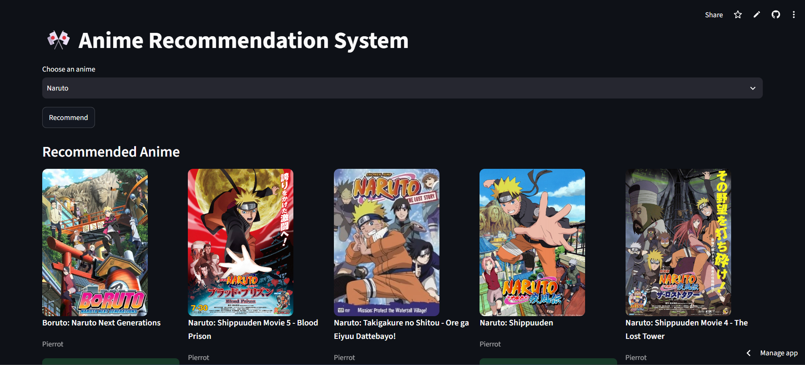

# 🎌 Anime Recommendation System

A **content-based anime recommendation system** built using Machine Learning and deployed with Streamlit.

The system recommends the **top 5 similar anime** based on user-selected anime using **Natural Language Processing (NLP)** and **cosine similarity**. Each recommendation includes the anime poster, studio information, and similarity score.

🚀 **Live Demo:**  
https://animerecommendationsystem-cypau9tgxdxat3gfcdytwz.streamlit.app/

---

# 📌 Project Overview

With thousands of anime titles available, finding new anime similar to personal preferences can be difficult.

This project solves that problem by building a recommendation engine that understands anime characteristics such as:

- Genre
- Story description
- Themes
- Keywords

When a user selects an anime, the system analyzes its content similarity with other anime and recommends the closest matches.

---

# ✨ Features

✅ Select anime from a searchable dropdown list  
✅ Generates top 5 similar anime recommendations  
✅ Displays anime posters  
✅ Shows studio information  
✅ Shows similarity percentage score  
✅ Fast recommendation using pre-computed recommendation mapping  
✅ Deployed as an interactive Streamlit web application  

---

# 🧠 Machine Learning Approach

This project uses a **Content-Based Filtering** approach.

## Workflow

```
Anime Dataset
      |
      |
Data Cleaning
      |
      |
Feature Engineering
      |
      |
Create Tags (Genre + Synopsis)
      |
      |
Text Vectorization
      |
      |
Cosine Similarity
      |
      |
Top 5 Similar Anime
      |
      |
Streamlit Interface
```

---

# 🔍 Recommendation Algorithm

## 1. Feature Engineering

Anime information was combined into a single feature called:

```
tags
```

The tags contain:

- Genres
- Synopsis
- Anime keywords

Example:

```
Naruto

Action Adventure Ninja Friendship
A young ninja seeks recognition...
```

---

## 2. Text Vectorization

The anime tags are converted into numerical vectors using:

```
CountVectorizer
```

This allows the model to compare anime based on textual similarity.

---

## 3. Similarity Calculation

Cosine similarity is used to measure similarity between anime vectors.

Formula:

```
Similarity(A,B) = 
(A · B) / (||A|| ||B||)
```

The higher the value, the more similar two anime are.

Example:

```
Naruto → One Piece

Similarity Score: 82%
```

---

# 🗂️ Dataset

The project uses MyAnimeList-based anime metadata.

Important features:

| Feature | Description |
|---|---|
| MAL_ID | Unique anime identifier |
| Title | Anime title |
| Genres | Anime genres |
| Synopsis | Story description |
| Studio | Production studio |
| Image URL | Anime poster |

---

# 🛠️ Tech Stack

## Programming Language

- Python

## Machine Learning

- Pandas
- NumPy
- Scikit-learn

## NLP

- CountVectorizer

## Similarity Algorithm

- Cosine Similarity

## Frontend

- Streamlit

## Deployment

- Streamlit Community Cloud

---

# 📁 Project Structure

```
anime-recommendation-system/

│
├── app.py
│
├── anime_list.pkl
│
├── recommendations.pkl
│
├── requirements.txt
│
├── Anime_Recommendation_System.ipynb
│
└── README.md
```

---

# ⚙️ Installation and Usage

## 1. Clone Repository

```bash
git clone https://github.com/your-username/anime-recommendation-system.git
```

Move into project directory:

```bash
cd anime-recommendation-system
```

---

## 2. Install Dependencies

```bash
pip install -r requirements.txt
```

---

## 3. Run Streamlit Application

```bash
streamlit run app.py
```

The application will open:

```
http://localhost:8501
```

---

# 📸 Application Preview

## Home Page




## Recommendation Result

```

---

# 🚀 Deployment

The application is deployed using:

```
Streamlit Community Cloud
```

Live application:

https://animerecommendationsystem-cypau9tgxdxat3gfcdytwz.streamlit.app/

---

# 🔮 Future Improvements

Possible future improvements:

- Add collaborative filtering using user ratings
- Add hybrid recommendation model
- Use transformer-based embeddings (BERT/Sentence Transformers)
- Add anime rating prediction
- Add user profile-based recommendations
- Add filtering by genre, studio, and release year

---

# 👨‍💻 Author

**MD Hasin Anjum**

Machine Learning | Data Science | Python

---

# ⭐ Acknowledgements

- MyAnimeList dataset community
- Scikit-learn documentation
- Streamlit framework

---

If you like this project, consider giving it a ⭐ on GitHub!
